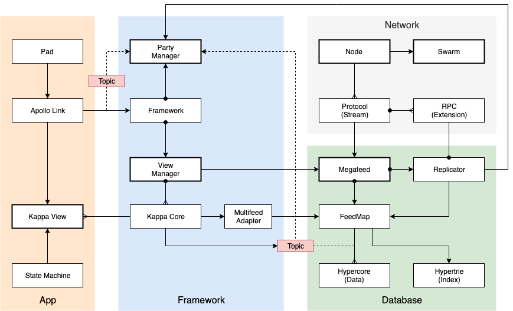

# Framework Design Document

The Framework is the top-level API that enables the development of P2P applications on the Wireline network.


## Overview

The diagram below illustrates the high-level system architecture.



### Apps

Applications (Apps) consist of Pads and Bots that operate within a Party, which is a lightweight virtual database.
Apps typically contain a state machine that defines a set of protocol types and a Query that specifies
a Data View, which is a materialized projection of the database.

### Database

The Database is a decentralized data structure that combines multiple Feeds (hypercores) from multiple participants (Peers).
Each Node has a local persistant Data Store that contains a map of Paths, which reference a logical set of Feeds.
The Database contains plugable logic that controls the Replication of these Feeds.

### Network

The Network is represented by a Swarm that manages connections between Peers over various network Transports (e.g., WebRTC).
Each Node connects to the Swarm and receives connection events when other Peers connect and request access to data.
Each Peer-to-Peer connection is mediated by the Dat protocol, which communicates via a shared Stream.
The protocol has plugable extensions that enable the Database (and Apps) to coordinate the exchange of data (and other messages).

### Framework

The Framework is the main API for the development of Apps.
It manages a set of Views (Kappa cores), which are connected to a logical set of Feeds identified by a Topic.
Topics correspond to a Party's discovery key.
The Framework can support many concurrent Parties, each of which may have many Participants.
The Framework also manages Access Control (Authorization) for the Participants (Bots and Users).
<<<<<<< HEAD
It maintains a set of Credentials for each Participant, which are written to the Participant's Feed.
The Framework's Party Manager controls the Policies by which the Database implements Replication.

=======
It maintains a set of Credentials (for each Participant) that confer specific access rights (e.g., read, write, User administration).
Users bestow Credentials on other Participants by writing Credentials on their Feeds.
The Framework's Party Manager uses these Credentials in conjunction with Policies that instruct the Database's Feed Replication mechanism. This is used to control access to the shared Data set.


## API

TODO(burdon): Work in progress:

```javascript
// Create framework objects.
const megafeed = new Megafeed({ node });
const viewFactory = new ViewFactory(megafeed);

// Get or create a unique kappa core instance for the given topic and view ID.
// This instance is "bound" to a closure that retrieves a set of feeds with the given topic.
const kappa = viewFactory.getOrCreateView({ topic, viewId });

// Add a view type.
kappa.use('log', new LogView());

// Create an app (state machine) with the given view.
// TODO(burdon): @elmasse, how is the view configured with the query (i.e., itemId).
const view = kappa.api['log'];
const app = new LogApp(view);

// Create feeds.
const hypercore1 = megafeed.addFeed({ topic });
const hypercore2 = megafeed.addFeed({ topic });

// Append to feeds.
hypercore1.append({ title: 'hello' });
hypercore2.append({ title: 'world' });

// Check results.
expect(app.list()).toBe(['hello', 'world']);
```

## References

* [Appendix](./appendix.md)
>>>>>>> 856ef67c7e814e31cb08cc25d25bd95aeb37f239
